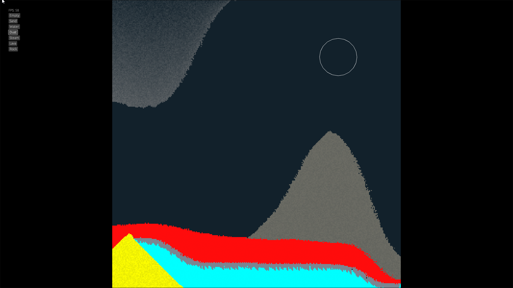

# Macro Sand [WIP]

Falling sand simulator (still WIP) inspired by [Sandspiel](https://sandspiel.club/) and [Sandspiel Studio](https://studio.sandspiel.club/) and [Noita](https://noitagame.com/). This Readme is currently a WIP.

## Features

- Builtin elements: Sand, Water, Dust, Steam, Lava and Rock
- Ability to define custom elements as a dynamic library for Windows, Linux and MacOS
- Simple GUI using Egui
- Perfomant: A 300*300 world can be simulated at 60 fps on a 2016 device on the WebAssembly target.
  
## Goals

The goal of this project is to create a perfomant sand simulation that it's also hackable. This already works on native platforms through dynamic libraries, but the objective is to make it work on the web too. That way particles are .wasm files that are platform agnostic.

Once that plugin system for loading particles at runtime is done a proper UI will be done and maybe even a particle "store" or something so users can share their particles and also snapshots of their simulations.

## Caveats

Currently, the simulation is moddable, you can create a particle in a dll an load it. But this is not as good as it appears, as this app is build upon Rust ABI, so if you're giving your friend, who compiled the app with X Rust version a DLL you compiled with Y Rust version, chances are it won't work. This and the std linking problem (described in the next section) are some of the reasons why I prefer to target this project to the web.

## Building 

There are two bat files for Windows, you can peek at them as they have simple profiles. Production just compiles a native version on your current platform using a custom profile and a nightly build. As app-core and default-plugins are dynamic libraries, everything has to be compiled with '-C prefer_dynamic'. This is a hussle because it works fine when doing cargo run but not when directly running the executable because it lacks the dynamic library for the std. We can easily get it from our rust installation but just the std is around 10MB, 5 times the size of the app itself. Because of this the production bat calls the nightly rust version you have installed using '-Z build-std'.

wasm.bat compiles the webasssembly version. You might get warnings on the console because up to this day there isn't a reasonable way to conditonal change the crate type depending on the target platform. For the wasm version, just take the app.wasm from target/wasm32-unknown-unknown/production and put it next to the root where index.html it, then just run basic-http-server on that directory.

# Architecture [WIP]

The project is divided into 3 crates:

- App-core: It contains the simulation logic and particle handling. It currently depends on macroquad, it could perfectly be abstracted to not depend on it but it's not a priority right now. We could say this is the backend of our app.
- App: It contains the GUI and the main loop. It depends on App-core and egui. It's just the crate that bundles everything together but this crate itself doesn't contain anything special. We could say this is the frontend of our app.
- Default-plugins: It contains the default particles that the simulation uses. It's a dynamic library that is loaded at runtime by the main app crate that sends it to app-core. On the wasm version, this is compiled as a static library and directly accessed to send the plugins to app-core.